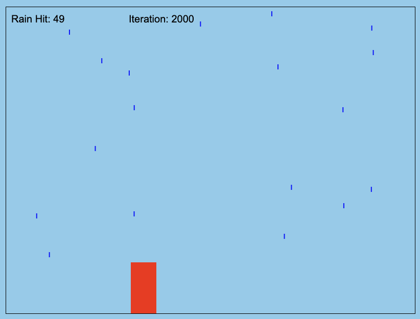

# Rain Simulation JS

This repository contains a simple 2D rain simulation implemented in JavaScript using HTML5 Canvas. The simulation demonstrates how the amount of rain hitting a person changes based on their speed and the direction of the rain. The simulation includes adjustable parameters for the speed of the person, the amount of rain, and the direction of the rain.

This was created to solve once and for all the great debate: "Is it faster to walk or run through the rain?". Inspired by the excellent Mythbusters episode.

## Getting Started

### Prerequisites

To run this simulation, you need a modern web browser that supports HTML5 and JavaScript.

### Running the Simulation

1. Clone the repository:
    ```bash
    git clone https://github.com/derme302/rainsimjs.git
    ```
2. Navigate to the project directory:
    ```bash
    cd rain-simulation
    ```
3. Open `index.html` in your web browser.

### Customizing the Simulation

You can adjust the parameters in the `simulation.js` file to explore different scenarios:

- **Person Speed**: Modify the `speed` property of the `person` object to change their movement speed.
- **Rain Direction**: Modify the `rainDirection` object to change the direction and speed of the rain.
- **Rain Frequency**: Adjust the probability in the `updateRainDrops()` function to control how often new raindrops are created.

## Example



## License

This project is licensed under the MIT License.

## Acknowledgments

- HTML5 Canvas documentation: [MDN Web Docs](https://developer.mozilla.org/en-US/docs/Web/API/Canvas_API)
- ChatGPT 4o: [ChatGPT](https://chatgpt.com/)
